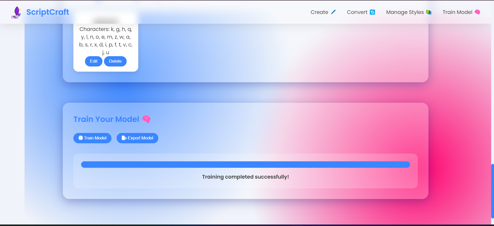

# ScriptCraft 📝✨

ScriptCraft is an innovative web-based application that brings the art of handwriting into the digital age. This powerful tool allows users to create, customize, and utilize their own unique handwriting styles in a virtual environment. By leveraging cutting-edge machine learning and artificial intelligence technologies, ScriptCraft offers an intuitive interface for users to craft their personal handwriting font.

---

## Demo

---

## Features 🚀

- **Handwriting Digitization**: Convert your handwriting into a digital font
- **AI-Powered Analysis**: Utilize machine learning to accurately capture writing styles
- **Customization Tools**: Fine-tune your digital handwriting to perfection
- **Cross-Platform Compatibility**: Use your handwriting font across various digital platforms
- **Cloud Storage**: Securely store and access your handwriting fonts from anywhere

## How It Works 🔍

1. **Write**: Provide handwriting samples through our user-friendly interface
2. **Analyze**: Our AI algorithms process and analyze your handwriting patterns
3. **Generate**: Create a unique digital font based on your handwriting
4. **Customize**: Fine-tune your font with our advanced editing tools
5. **Use**: Apply your personal handwriting font in digital documents, emails, and more!

## Screenshots 📸

*ScriptCraft's intuitive user interface*

*AI-powered handwriting analysis in action*

## Getting Started 🏁

Visit [ScriptCraft.com](https://www.scriptcraft.com) to start creating your personal handwriting font today!

## Technologies Used 💻

- HTML5, CSS3, JavaScript
- Machine Learning & AI algorithms
- Cloud computing for storage and processing

## Testimonials 💬

> "ScriptCraft has revolutionized the way I personalize my digital communications!" - Jane Doe, Graphic Designer

> "As an educator, ScriptCraft helps me create more engaging online materials for my students." - John Smith, Professor

## Contact Us 📞

- Email: info@scriptcraft.com
- Phone: (123) 456-7890
- [Twitter](https://twitter.com/scriptcraft)
- [Facebook](https://facebook.com/scriptcraft)

## License 📄

ScriptCraft is released under the MIT License. See the [LICENSE](LICENSE) file for details.

---

Bring your handwriting to life in the digital world with ScriptCraft! ✍️🖥️
